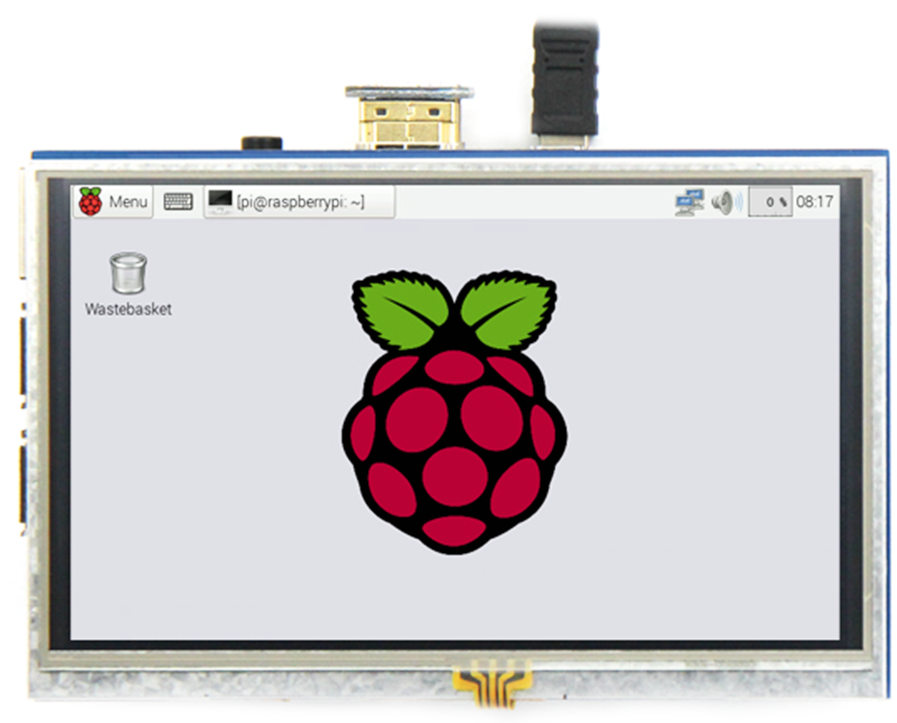
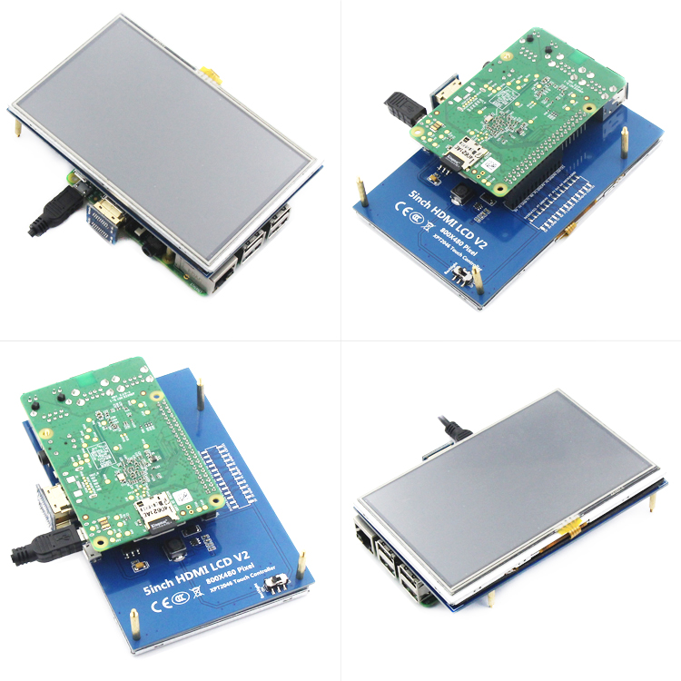
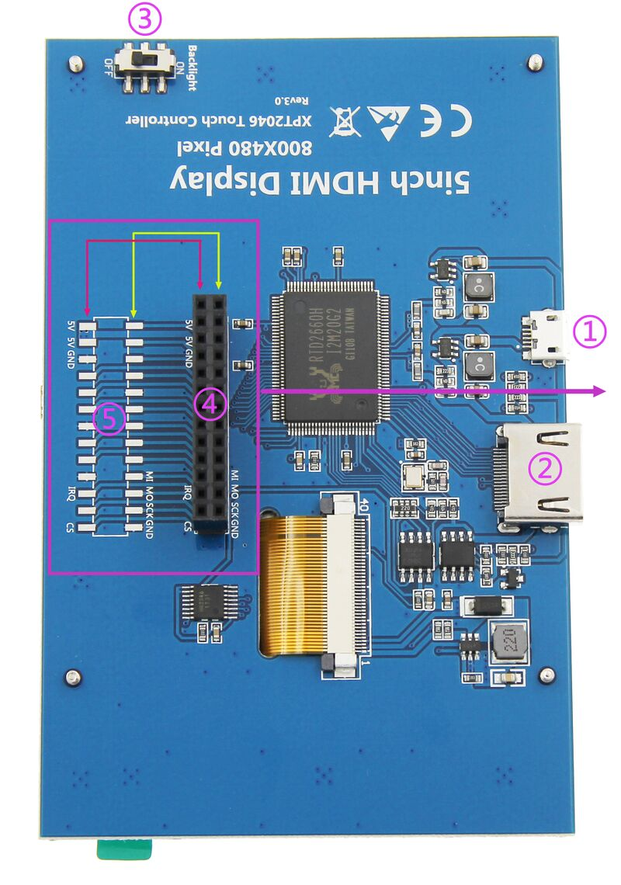
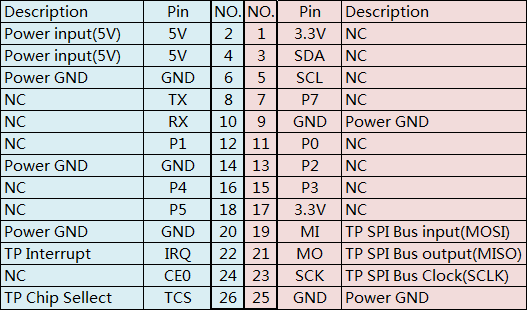
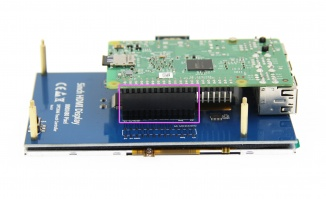
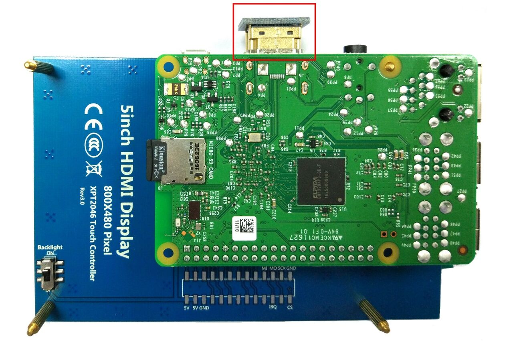

## 产品视频


## 产品图片




## 产品介绍
- 5inch标准显示器，硬件分辨率800×480
- 带电阻触摸屏，支持触摸控制S
- 支持背光单独控制，可关闭背光节省功耗
- 支持标准HDMI接口输入，兼容并可直接插入树莓派所有版本的主板(4代3代2代1代)
- 可作为通用HDMI显示器使用，如接电脑HDMI作为副显示器(分辨率输出要能调整为800X480)
- 如仅用作显示则无需占用IO资源(树莓派使用触摸功能时需占用IO资源)
- 本产品通过CE、RoHS认证

## 产品参数
- 尺寸: 5.0(inch)
- SKU: MPI5008
- 分辨率: 800×480(dots)
- 背光亮度：270cd/m²
- 触摸: 4线电阻触摸
- 外形尺寸: 121.11×77.93(mm)
- 显示区域: 108.00×64.80(mm)
- 包装尺寸: 154×135×51 (mm)
- 重量(含包装): 206(g)
- 功耗: 0.34A×5V

## 硬件说明
### 接口定义


① USB 供电接口：USB供电输入（5V），如图④母座已连接树莓派取电，则此USB可不接
② HDMI 接口：用于连接主板和 LCD 显示屏进行HDMI传输
③ 背光开关：控制背光打开和关闭，可节省功耗
④ 电源和触摸接口：从树莓派取电给液晶屏，同时将触摸信号通过GPIO回传至树莓派
⑤ 扩展接口：将图④母座占用的GPIO口PIN对PIN引出，方便扩展使用

### 产品尺寸


## 与树莓派连接
 
    连接步骤1
   ① 将LCD 13×2Pin母座按上图与树莓派连接
 
    连接步骤 ② 将配套的HDMI转接头与树莓派连接


## 在树莓派Raspbian/Ubuntu Mate/Win10 IoT Core系统中使用
### 步骤1: 安装官方镜像
1. 从官方下载最新镜像
2. 按官方教程步骤安装好系统

### 步骤2: 安装LCD驱动
#### 方法一：在线安装(树莓派需连接互联网)
1. 用Putty连接登陆树莓派系统到用户命令行(初始用户名:pi 密码:raspberry)
2. 执行以下命令(复制后在Putty窗口中单击鼠标右键即可粘贴):
```markdown
sudo rm -rf LCD-show
git clone https://github.com/goodtft/LCD-show.git
chmod -R 755 LCD-show
cd LCD-show/
sudo ./LCD5-show
``` 

#### 方法二：离线安装
1. 从光盘中拷贝“LCD-show.tar.gz”驱动到树莓派系统卡根目录下；
（推荐步骤1烧录完成后将驱动直接拷贝到Micro SD卡，或使用SFTP等办法远程拷贝）
2. 执行以下操作命令解压安装驱动:
```markdown
cd /boot
sudo tar zxvf LCD-show.tar.gz
cd LCD-show/
sudo ./LCD5-show
``` 

### 步骤3：
执行完上述步骤后，树莓派将自动重启，即可正常触摸和显示。

## 如何作为电脑显示器使用
- 使用HDMI连接线将电脑HDMI输出信号连接至LCD的HDMI接口;
- 将MicroUSB连接线一端连接LCD的USB 接口，另一端连接至电脑的USB端口或者USB充电口。
- 如有多个显示器，请先拔掉其他显示器接口，将本LCD作为唯一显示器进行测试。
作为电脑显示器用，触摸功能将不可用。

## 如何旋转显示方向
注：此方法只针对树莓派系列的显示屏，其它显示屏并不适用
#### 第一步，如果还没有安装驱动，请执行下面的命令（树莓派需要联网）：
```
sudo rm -rf LCD-show
git clone https://github.com/goodtft/LCD-show.git
chmod -R 755 LCD-show
cd LCD-show/
sudo ./XXX-show
```
执行完毕之后，驱动会安装好，系统会自动重启，然后显示屏就正常显示和触摸
（' XXX-show '要改为对应的驱动）

#### 第二步，如果已经安装好驱动，请执行下面的命令：
```
cd LCD-show/
sudo ./rotate.sh 90
```
执行完毕之后，系统会自动重启，然后显示屏就可以旋转90度正常显示和触摸
（' 90 '也可以改为0，90，180，270等数值，分别代表旋转角度0度，90度，180度，270度）
```
如果提示 rotate.sh 找不到，请回到 第一步，安装最新的驱动
如果是HDMI接口显示屏使用Raspberry Pi 4，需要先把config.txt文件中的 dtoverlay=vc4-fkms-V3D 注释掉(注意：最新的2024-07-04系统不需要这一步骤)
```
（config.txt文件位于Micro SD卡根目录，即/boot中）
## 常见问题
- 树莓派常见问题
- 如何在树莓派4中使用双屏显示
- 电阻触摸屏长按屏幕唤出鼠标右键功能
- 树莓派官方系统2021-03-04，2021-05-07安装驱动后，蓝牙无法使用？
## 资源下载
### 文档
- 5inch_HDMI_Display_用户手册(CN)
- 如何安装LCD驱动-V1.2
- 如何校准电阻触摸屏-V1.2
- 如何修改显示方向和触摸-HDMI-电阻触摸-V1.2
- 如何安装虚拟键盘(CN)
- 树莓派入门教程(下载，格式化，烧录，SSH，PuTTy)-V1.0
- 产品尺寸图
- 关于树莓派电阻触摸翻转问题说明
## 驱动下载
本地下载:LCD-show.tar.gz
镜像下载
如果你觉得前面步骤的修改配置、安装驱动都比较困难或者仍然显示异常，请先使用我们预装好驱动的镜像，
下载后解压并把镜像写入到Micro SD卡中。然后把卡插入树莓派就可以使用了。
镜像名称	支持的树莓派版本	用户名	密码
Raspbian	Pi4B,Pi3B+/Pi3B,Pi2B,PiB+/PiB,Pi3A+,PiA+,Pi Zero W,Pi Zero	pi	raspberry
Ubuntu-MATE-32bit	Pi4B,Pi3B+/Pi3B,Pi2B,PiB+/PiB,Pi3A+,PiA+	pi	raspberry
Kali Linux
RaspberryPi-32bit

Pi4B,Pi3B+/Pi3B,Pi2B,PiB+/PiB,Pi3A+,PiA+	kali	kali
Image Name	Version	Download
Raspbian	2025-05-13	BaiduYun:	MPI5008-5inch-A-2025-05-13-raspios-bookworm-armhf(Pi4-Pi5) 提取码：sgbv
Mega:	MPI5008-5inch-A-2021-10-30-raspios-buster-armhf.7z
Ubuntu-MATE-32bit	22.04	BaiduYun:	MPI5008-5inch-A-ubuntu-mate-22.04-desktop-armhf+raspi.7z 提取码：u7q3
Mega:	MPI5008-5inch-A-ubuntu-mate-20.1-desktop-armhf+raspi.7z
Kali Linux RaspberryPi-32bit	2025.1	BaiduYun:	MPI5008-5inch-A-kali-linux-2025.1 提取码：psmp
Mega:	MPI5008-5inch-A-kali-linux-2021.2
镜像文件MD5校验
常用软件
Panasonic SDFormatter
Win32DiskImager
PuTTY
