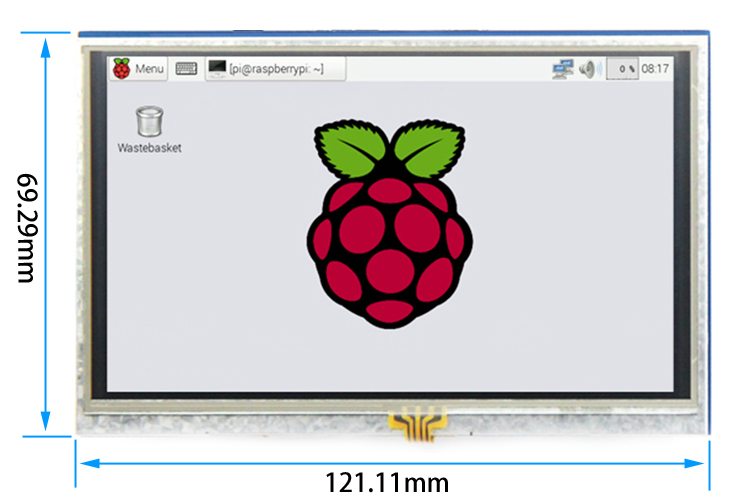

## Product Video

## Product Images

## Product Introduction

- 5-inch standard display with hardware resolution of 800×480
- Equipped with a resistive touch screen, supporting touch control
- Supports independent backlight control; backlight can be turned off to save power
- Supports standard HDMI interface input and is compatible with all versions of Raspberry Pi motherboards (Gen 4, 3, 2, 1)
- Can be used as a general-purpose HDMI monitor, e.g., connected to a computer's HDMI as a secondary display (output resolution must be adjusted to 800×480)
- If used only for display, no IO resources are occupied (touch function requires occupying IO resources on Raspberry Pi)
- This product is CE and RoHS certified

## Product Parameters

- Size: 5.0 (inch)
- SKU: MPI5008
- Resolution: 800×480 (dots)
- Backlight Brightness: 270 cd/m²
- Touch: 4-wire resistive touch
- Outline Dimensions: 121.11×77.93 (mm)
- Display Area: 108.00×64.80 (mm)
- Packaging Dimensions: 154×135×51 (mm)
- Weight (with packaging): 206 (g)
- Power Consumption: 0.34A × 5V

## Hardware Description

### Interface Definition

① **USB Power Interface**: USB power input (5V). If the female header in Figure ④ is already connected to the Raspberry Pi for power, this USB port can be left unconnected.  
② **HDMI Interface**: Used to connect the motherboard and LCD for HDMI transmission.  
③ **Backlight Switch**: Controls turning the backlight on/off to save power.  
④ **Power & Touch Interface**: Draws power for the LCD from the Raspberry Pi while returning touch signals to the Raspberry Pi via GPIO.  
⑤ **Expansion Interface**: PIN-to-PIN extension of the GPIO pins occupied by the female header in Figure ④, facilitating expansion use.

### Product Dimensions

## Connecting to Raspberry Pi

- **Connection Step 1**  
  ① Connect the LCD's 13×2Pin female header to the Raspberry Pi as shown above.  
  

- **Connection Step 2**  
  ② Connect the included HDMI adapter to the Raspberry Pi.

## Usage on Raspberry Pi (Raspbian / Ubuntu Mate / Win10 IoT Core)

### Step 1: Install Official Image

1. Download the latest image from the official website.
2. Follow the official tutorial steps to install the system.

### Step 2: Install LCD Driver

#### Method 1: Online Installation (Raspberry Pi must be connected to the internet)

1. Use Putty to log in to the Raspberry Pi command line (Default Username: `pi`, Password: `raspberry`).
2. Execute the following commands (copy and right-click in the Putty window to paste):